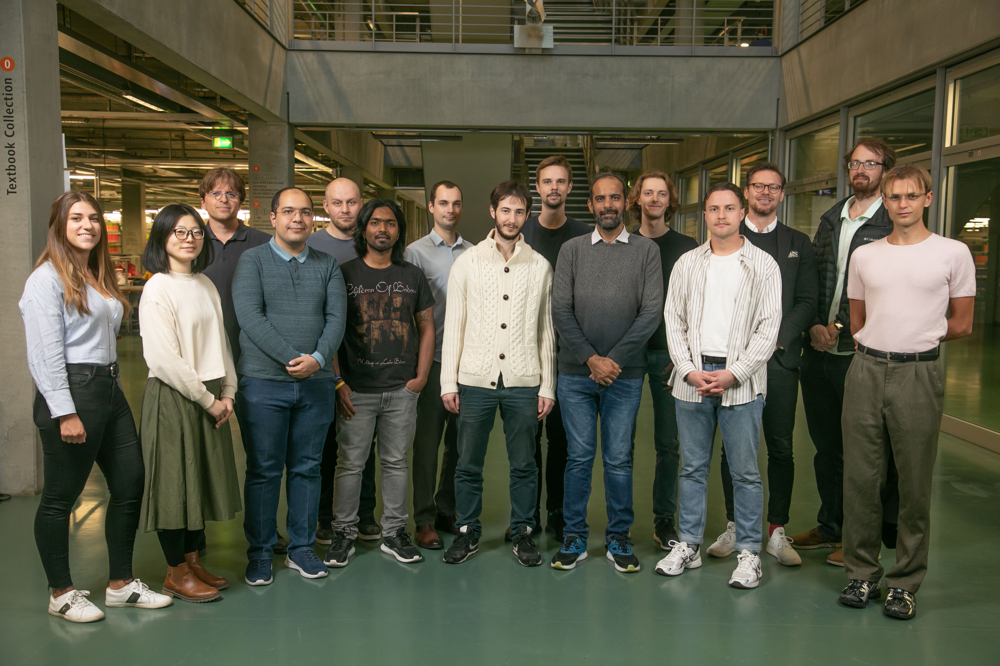

# Internet Network Architectures

  

    
    
<small>Members of FG INET (April 2015)</small>

    
©&nbsp;Fabian Schneider / Philipp S. Schmidt

  

  

    <h3>News</h3>
    

    

      <ul>
        <li><strong>Stefan Schmid is the new head of the INET group</strong> In May 2021 Stefan Schmid has
          been appointed Professor and new head of the INET research group.  </li>
        <li><strong>Anja Feldmann goes to Max-Planck-Institut for computer science</strong> Since January
          2018&nbsp; Anja Feldmann is a new director at Max-Planck-Institut for computer science in Saarbrücken.
          She established a new research group named Internet Architecture (INET) in the field of network
          architectures and wide-area data analytics.   </li>
      </ul>
    

  

  

    <h3>Welcome to FG INET</h3>
    

    

      

        <h5 class="bg-white p-2">
          <a href="news/"><em>News &amp; Events at FG INET</em>News and Events</a>
        </h5>
        <ul>
          <li>General News</li>
          <li><a href="news/nls/">Networking Lecture Series</a></li>
          <li><a href="news1/pgt/">General Talks</a></li>
        </ul>
      

      

        <h5 class="bg-white p-2">
          <a href="teaching0/"><em>Teaching at FG INET</em>Teaching</a>
        </h5>
        <ul>
          <li><a href="teaching0/ws2020211/">Current term</a></li>
          <li><a href="teaching0/infoteaching/">General information</a></li>
          <li><a href="teaching0/infoteaching/faq0/">FAQ</a></li>
        </ul>
      

    

    

      

        <h5 class="bg-white p-2">
          <a href="people/"><em>People at FG INET</em>People</a>
        </h5>
        <ul>
          <li><a href="people/profs0/anja/">Anja Feldmann</a></li>
        </ul>
      

      

        <h5 class="bg-white p-2">
          <a href="research/"><em>Research at FG INET</em>Research</a>
        </h5>
        <ul>
          <li><a href="research/publications/">Publications</a></li>
        </ul>
      

    

  

